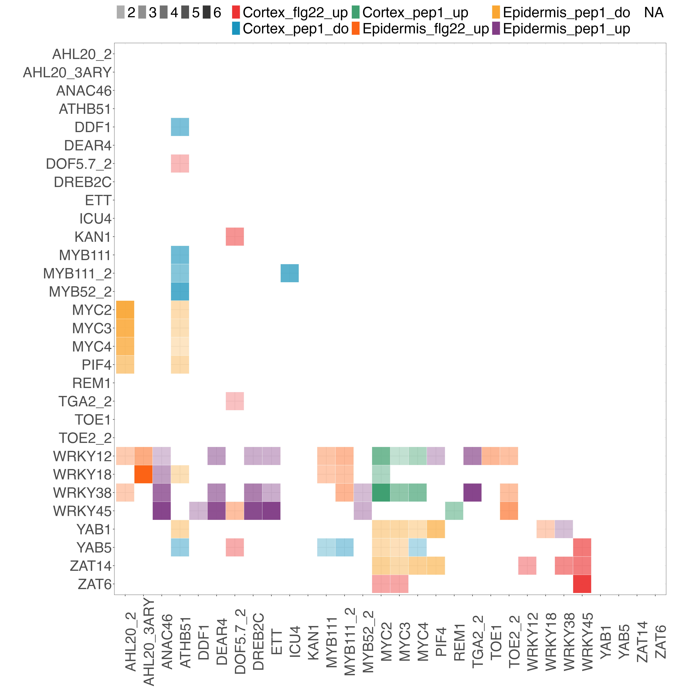

# PMET Analysis

PMET (Paired Motif Enrichment Test) is a tool for identifying enriched motif pairs in genomic sequences.

## Motif Pair Enrichment Heatmap



This repository contains a visualization of enriched motif pairs across different gene clusters, generated using the PMET (Paired Motif Enrichment Test) tool. The heatmap above illustrates the enrichment patterns of motif pairs in various conditions and tissues, specifically focusing on cortex and epidermis with different treatment states denoted as "up" or "down".

Key Features:

- Gene clusters: Rows represent different gene clusters associated with several transcription factors.
- Motif pair enrichment: Colors represent the enrichment of motif pairs, with each color corresponding to a specific condition.
- Conditions: Cortex_flg22_up, Cortex_pep1_up, Epidermis_pep1_do, Cortex_pep1_do, Epidermis_flg22_up, Epidermis_pep1_up.
- Visualization details: The intensity and hue indicate enrichment strength, enabling quick assessment of which gene clusters are enriched under specific conditions.

This visualization serves as an effective tool for exploring the interactions between motifs under diverse biological contexts, facilitating a deeper understanding of gene regulation mechanisms in different tissues.

## Project Structure

```
.
├── run.sh              # Interactive pipeline launcher
├── pipeline/           # Analysis pipelines
│   ├── 00_requirements_reminder.sh
│   ├── 01_PMET_promoter.sh
│   ├── 02_PMET_intervals.sh
│   ├── 03_PMET_genomic_*.sh
│   ├── 06_PMET_promoter_benchmark_parameters.sh
│   ├── 07_PMET_promoters_distance_to_tss.sh
│   └── 08_heterotypic_promoters_single_CPU.sh
├── scripts/            # Core scripts and utilities
├── build/              # Compiled binaries
├── data/               # Input data (genome, motifs, gene lists)
└── results/            # Output results
```

## Quick Start

### 1. Check Requirements & Setup

```bash
bash run.sh
# Select [0] to check requirements and setup environment
```

Or run directly:

```bash
bash pipeline/00_requirements_reminder.sh
```

This will:

- Check for required tools (fimo, samtools, bedtools, parallel)
- Download TAIR10 genome and annotation if needed
- Clone and compile PMET binaries

### 2. Run Analysis Pipelines

Use the interactive launcher:

```bash
bash run.sh
```

Select a pipeline from the menu:

| #   | Pipeline                                   | Description                                          |
| --- | ------------------------------------------ | ---------------------------------------------------- |
| 0   | 00_requirements_reminder.sh                | Check system requirements and setup                  |
| 1   | 01_PMET_promoter.sh                        | Run PMET on promoter regions                         |
| 2   | 02_PMET_intervals.sh                       | Run PMET on genomic intervals (e.g., ATAC-seq peaks) |
| 3   | 03_PMET_genomic_all_element_isoforms.sh    | Run PMET on genomic elements (all isoforms)          |
| 4   | 03_PMET_genomic_element_longest_isoform.sh | Run PMET on genomic elements (longest isoform)       |
| 5   | 03_PMET_genomic_merged_element_isoforms.sh | Run PMET on genomic elements (merged isoforms)       |
| 6   | 06_PMET_promoter_benchmark_parameters.sh   | Benchmark PMET parameters                            |
| 7   | 07_PMET_promoters_distance_to_tss.sh       | Analyze motifs with distance to TSS                  |
| 8   | 08_heterotypic_promoters_single_CPU.sh     | Heterotypic motif analysis (single CPU)              |

Or run any pipeline directly:

```bash
bash pipeline/01_PMET_promoter.sh
```

## Requirements

The following tools are required:

- **fimo** (from MEME Suite) - Motif scanning
- **samtools** - FASTA indexing
- **bedtools** - Genomic interval operations
- **GNU parallel** - Parallel processing

Install via conda:

```bash
conda install -c bioconda meme samtools bedtools parallel
```

## License

See [LICENSE.md](LICENSE.md)
